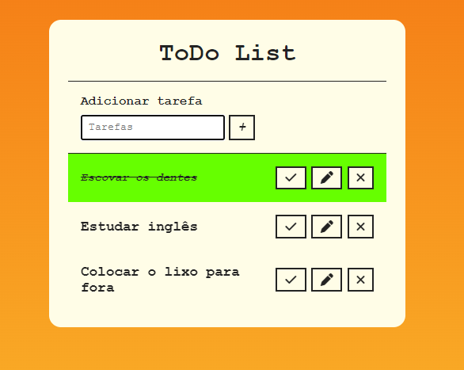

# ToDoList
## Descrição do Projeto: 
- Esse projeto é uma aplicação web desenvolvida em JavaScript que permite ao usuário criar, editar e excluir tarefas a fazer. Cada tarefa é exibida em uma lista e o usuário pode marcar a tarefa como concluída, o que faz com que a tarefa fique com a cor verde.
- Esse projeto é útil para quem busca organizar suas atividades diárias de forma prática e eficiente, e pode ser facilmente integrado em outros projetos web como um módulo.

## Tecnologias usadas
- JavaScript: para o gerenciamento e validação dos dados.
- HTML: Para marcação;
- CSS: Para estilização;

## Como Usar
- Faça o download do repositório ou clone para sua maquina;
- Abra o aplicativo em um navegador da web;
- Adicione, marque como concluída, edite ou exclua suas tarefas;

## Autor
- Eu :)
- Desenvolvido com ajuda de um vídeo do youtube.

## Alguns pontos a melhorar e que eu quero implementar
- Função de busca para as tarefas;
- Utilização de localStorage, para mesmo após o usuário fechar a página e voltar mais tarde, as tarefas continuarem lá.

